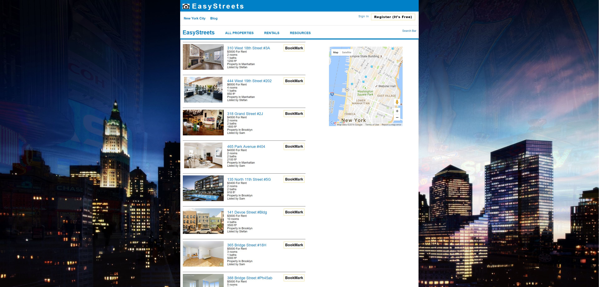
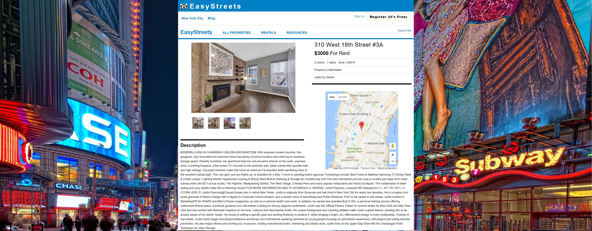
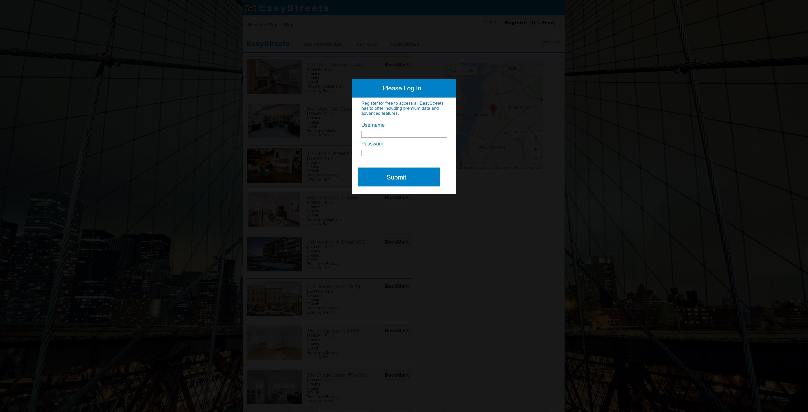
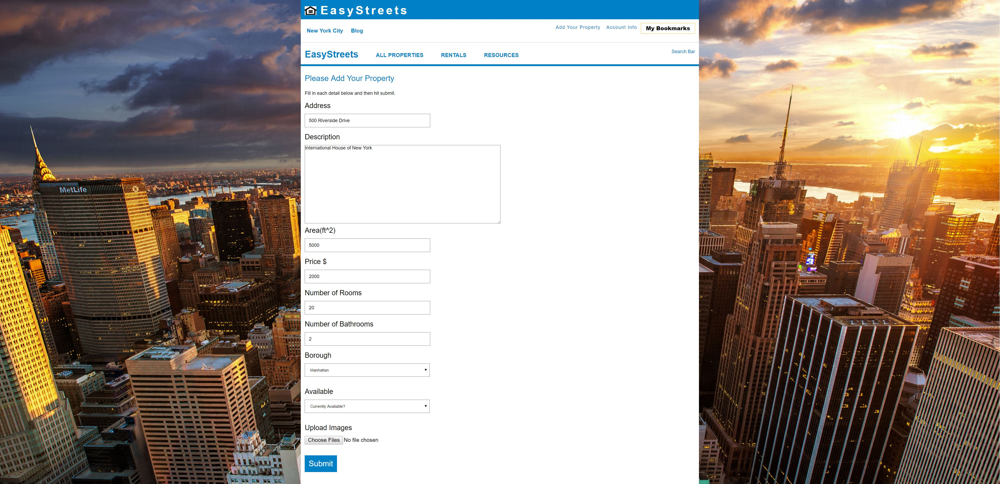
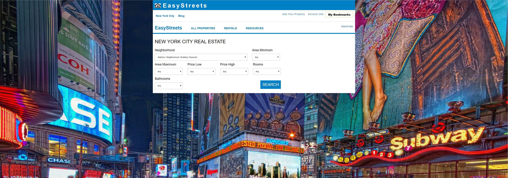

##**EasyStreets**

EasyStreets is a web application used to showcase and upload New York City property
listings in a StreetEasy.com inspired setup.

Take a look at <a href='easystreets.herokuapp.com'>EasyStreets Live</a>

##**Views**






##**Features**
* Enables dynamic location-based property search using Google Maps API
* Submit New Properties to the site
* Uploads multiple real estate pictures simultaneously to Amazon S3
* Provides fast multi-search based on user specified parameters
* Indexes Data for fast database multi-search
* Allows users to bookmark the properties they are interested in
* Background automatically changes to simulate traveling through NYC

##**Technical Highlights**

**Property Geolocation**<br/>
One of the more nifty features of the app. When a user submits a property to the site,
the google maps API is used to locate the real-world coordinates (latitude and longitude)
of the site. These coordinates are then made a part of the model object and stored in the
PostgreSQL database.

```
// Find the real world property and attach image files. Submit to backend.
handleSubmit: function(e) {
  e.preventDefault();
  var geocoder = new google.maps.Geocoder();
  geocoder.geocode({'address': this.state.address}, function(results, status){

    if (status == google.maps.GeocoderStatus.OK) {
      var latResult = results[0].geometry.location.lat();
      var lngResult = results[0].geometry.location.lng();
      this.setState({ lat: latResult, lng: lngResult });

      var formData = new FormData();

      formData.append("property[address]", this.state.address);
      formData.append("property[description]", this.state.description);
      formData.append("property[area]", this.state.area);
      formData.append("property[price]", this.state.price);
      formData.append("property[num_rooms]", this.state.num_rooms);
      formData.append("property[num_bathroom]", this.state.num_bathroom);
      formData.append("property[borough_id]", this.state.borough_id);
      formData.append("property[availability]", this.state.availability);
      formData.append("property[lat]", latResult);
      formData.append("property[lng]", lngResult);

      for (var j = 0; j < this.state.imageFiles.length; j++) {
        formData.append("property[images][" + j + "]", this.state.imageFiles[j]);
      }

      ApiUtil.createProperty(formData, function(property) {
        this.context.router.push('/properties/' + property.id);
      }.bind(this));

    }
    else {
      console.log('didnt find the address');
    }
  }.bind(this));
},
```

**Fast MultiSearch**<br/>
Initially I did not index each column in the property model because I was not
expecting the size of my data set to be particularly large. However, to accommodate
an increase in the size of the property database I will be adding an index to the
following columns in property model : [area, price, number_rooms, number_bathrooms,
borough_id]. This will turn a full table scan (O(n)) into a binary search (O(log n))
and greatly increase the query efficiency.
```
handleSubmit: function(e) {
  e.preventDefault();
  var query = {
    neighborhood: this.state.neighborhood,
    areaLow: this.state.areaLow,
    areaHigh: this.state.areaHigh,
    priceLow: this.state.priceLow,
    priceHigh: this.state.priceHigh,
    num_rooms: this.state.num_rooms,
    num_bathroom: this.state.num_bathroom
  };

  this.context.router.push({
    pathname: '/search',
    query: query,
    state: {}
  });
},

class Api::SearchController < ApplicationController

  def index
    @properties = Property
      .where(borough)
      .where(priceLow)
      .where(priceHigh)
      .where(areaLow)
      .where(areaHigh)
      .where(numRooms)
      .where(numBathroom)

    render :index
  end
end
```

**Bookmark Component**<br/>
A user can bookmark a specific property and instantly see the bookmark marker
on the page. To accomplish this I created a separate store and component for the
bookmarks. Whenever a property is bookmarked, the bookmark is created in the backend,
the store is updated and a re-render is instantly triggered.

```
var React = require('react');
var PropertyStore = require('../stores/property.js');
var BookmarkStore = require('../stores/bookmark_store.js');
var SessionStore = require('../stores/session_store.js');
var ApiUtil = require('../util/api_util.js');
var ApiActions = require('../actions/api_actions.js');
var Link = require('react-router').Link;

var PropertyIndex = React.createClass({

  _bookmarkArray: function() {
    var arr = BookmarkStore.all().map(function(bookmark) {
      return (bookmark.property_id);
    });

    return arr;
  },

  _onChangeBookmark: function() {
    this._bookmarkArray();
    this.setState({ bookmarks: BookmarkStore.all()});
  },

  _addBookmark: function(property) {
    ApiUtil.addBookmark(property);
  },

  render: function() {
    var myProperties = this.state.properties.map(function(property, i) {
      var button = null;
      if (this._bookmarkArray().includes(property.id)) {
        button = <button className="bookmark-button-saved">Saved</button>;
      }
      else {
        button = <button className="bookmark-button" onClick={this._addBookmark.bind(null, property)}>BookMark</button>;
      }

      return(
        <div className="property-item group"  key={i} onMouseEnter={this._focusProperty.bind(null, property)} >
          <Link to={"/properties/" + property.id }>
            
            <ul className="property-listing">
              <li className="property-address">
                {property.address}
              </li>
              <li className="property-price">
                ${property.price} For Rent
              </li>
              <li>
                {property.num_rooms} rooms
              </li>
              <li>
                {property.num_bathroom} baths
              </li>
              <li>
                {property.area} ft²
              </li>
              <li>
                Property in {property.borough_id}
              </li>
              <li>
                Listed by {property.author_id}
              </li>
            </ul>
          </Link>
          {button}
        </div>
      );
    }.bind(this));

    return (
      <ul className="property-index">
        { myProperties }
      </ul>

    );
  }
});
```

###**To-Do**
- [ ] Make Facebook Oauth login.
- [ ] Make Google Oauth login.
- [ ] Create a component which shows data statistic for property queries.
- [ ] Implement most bookmarked/searched properties.
